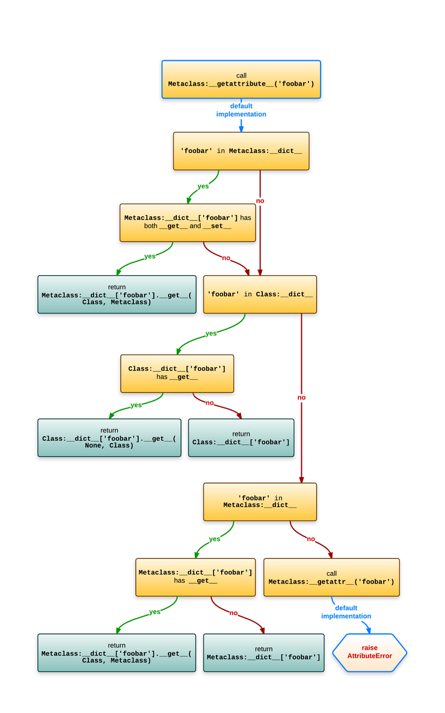

# Quick Tip: What Is a Metaclass in Python


This quick tip gives a brief overview of what we mean by a metaclass in Python and shows some examples of the concept.

Before delving into this article, I should point out an important point [about classes in Python](http://code.tutsplus.com/tutorials/a-smooth-refresher-on-pythons-classes-and-objects--cms-25598) which makes it easier for us to grasp the concept of metaclasses.

## Is a Class an Object in Python?!


If you've used a programming language other than Python, the concept you understood about classes is most likely that it is a way used to create new objects. This is also true in Python, but Python even takes it one more step further—classes are also considered objects!

So, if you created the following class in Python:

```python	
class myClass(object):
    pass
```
This simply means that an object with the name myClass has been created in memory. Since this object is able to create new objects, it is considered a class. This means we can apply object operations on classes in Python, as classes are objects themselves.

We can thus do operations on classes like assigning the class to a variable, as follows:
```python	
class_object = myClass()
print class_object
```
Which returns:
```python	
<__main__.myClass object at 0x102623610>
```

You can even pass the class `myClass` as a parameter to a method, as follows:
```python	
def class_object(object):
    print object
     
class_object(myClass)
```

Which returns the following output:
```python	
<class '__main__.myClass'>
```
In addition to other operations you can normally apply on objects.

## Metaclasses

Maybe you have come across the `type` keyword in Python? You most likely used it to check the type of some object, as shown in the following examples:
```python	
print type('abder')
print type(100)
print type(100.0)
print type(int)
```
In which case you would get the following output:
```python	
<type 'str'>
<type 'int'>
<type 'float'>
<type 'type'>
```
Looking at the output, everything seems pretty clear until you come to the type type. To see what this might mean, let's go back to our class we defined at the beginning of this article:
```python	
class myClass(object):
    pass
```
Now, do the following:
```python	
print type(myClass)
```
What would be the output of this statement? It will surprisingly be:
```python	
<type 'type'>
```
So, we can conclude that the type of classes in Python is `type`!

What is the relation between a `type` and a `metaclass`? Well, a `type` is a `metaclass`, provided that the default `metaclass` is `type`. I know this might be confusing, especially that type can be used to return the class of some object as shown above, but this is due to the backward compatibility in Python. So, if you write:
```python	
print type(type)
```
You will get:

```python	
<type 'type'>
```


Meaning that a `type` is a `type`!

The term `metaclass` simply means something used to create classes. In other words, it is the class of a class, meaning that the instance of a class in this case is a class. Thus, `type` is considered a `metaclass` since the instance of a `type` is a class.

For instance, when we mentioned the following statement above:
```python	
class_object = myClass()
```

This simply builds an object/instance of the class `myClass`. In other words, we used a class to create an object. 

In the same way, when we did the following:
```python	
class myClass(object):
    pass
```
The `metaclass` was used to create the class `myClass` (which is considered a `type`). So, like the object being an instance of a class, a class is an instance of a `metaclass`.


### Using Metaclass to Create a Class

In this section, we are going to see how we can use a `metaclass` to create a class, rather than using the `class` statement as we saw in the classes and objects tutorial. As we saw above, the default `metaclass` is `type`. Thus, we can use the following statement to create a new class:
```python	
new_class = type('myClass',(),{})
```
If you want to make things simpler, you can assign the same class name myClass to the variable name.

The dictionary `{ }` here is used to define the attributes of the class. So, having the following statement:
```python	
myClass = type('myClass',(),{'a':True})
```
Is similar to:
```python	
class myClass(object):
    a = True
```
### The __metaclass__ Attribute

Say that we created the class `myClass` as follows:
```python	
class myClass(object):
    __metaclass__ = myMetaClass
    pass
```
In this case, class creation will occur using myMetaClass instead of type, as follows:
```python	
myClass = myMetaClass(className, bases, dictionary)
```

### Creation and Initialization of a Metaclass

If you want to have control on how you create and initialize a class after its creation, you can simply use the metaclass __new__ method and __init__ constructor, respectively. So, when myMetaClass above is called, this is what will be happening behind the scenes:

```python	
myClass = myMetaClass.__new__(myMetaClass, name, bases, dictionary)
myMetaClass.__init__(myClass, name, bases, dictionary)
```
  
    
      


> **Source:**   
> :fa-link: https://code.tutsplus.com/tutorials/quick-tip-what-is-a-metaclass-in-python--cms-26016

-------------


## Understanding Python metaclasses from Ionelmc.ro

## A quick overview


A high level explanation is necessary before we get down to the details.

A class is an object, and just like any other object, it's an instance of something: a metaclass. The default metaclass is type. Unfortunately, due to backwards compatibility, type is a bit confusing: it can also be used as a function that return the class [13] of an object:

```python	
>>> class Foobar:
...     pass
...
>>> type(Foobar)
<class 'type'>
>>> foo = Foobar()
>>> type(foo)
<class '__main__.Foobar'>
```
If you're familiar with the isinstance builtin then you'll know this:
```python	
>>> isinstance(foo, Foobar)
True
>>> isinstance(Foobar, type)
True
```
To put this in picture:

  

But lets go back to making classes ...

### Simple metaclass use
We can use type directly to make a class, without any class statement:

```python	
>>> MyClass = type('MyClass', (), {})
>>> MyClass
<class '__main__.MyClass'>
```
The class statement isn't just syntactic sugar, it does some extra things, like setting an adequate __qualname__ and __doc__ properties or calling __prepare__.

We can make a custom metaclass:
```python	
>>> class Meta(type):
...     pass
```

And then we can use it :
```python	
>>> class Complex(metaclass=Meta):
...     pass
>>> type(Complex)
<class '__main__.Meta'>
```
Now we got a rough idea of what we'll be dealing with ...


### Magic methods

One distinctive feature of Python is magic methods: they allow the programmer to override behavior for various operators and behavior of objects. To override the call operator you'd do this:
```python	
>>> class Funky:
...     def __call__(self):
...         print("Look at me, I work like a function!")
>>> f = Funky()
>>> f()
Look at me, I work like a function!
```
Metaclasses rely on several magic methods so it's quite useful to know a bit more about them.

###  The slots

When you define a magic method in your class the function will end up as a pointer in a struct that describes the class, in addition to the entry in __dict__. That struct [7] has a field for each magic method. For some reason these fields are called type slots.

Now there's another feature, implemented via the __slots__ attribute. A class with __slots__ will create instances that don't have a __dict__ (they use a little bit less memory). A side-effect of this is that instances cannot have other fields than what was specified in __slots__: if you try to set an unexpected field you'll get an exception.

For the scope of this article when slots are mentioned it will mean the type slots, not __slots__.


### Object attribute lookup
Now this is something that's easy to get wrong because of the many slight differences to old-style objects in Python 2. 

Assuming Class is the class and instance is an instance of Class, evaluating instance.foobar roughly equates to this:

-   Call the type slot for Class.__getattribute__ (tp_getattro). The default does this:  
    -  Does Class.__dict__ have a foobar item that is a data descriptor ?    
	      - If yes, return the result of Class.__dict__['foobar'].__get__(instance, Class).  
	-  Does instance.__dict__ have a foobar item in it?     
		- If yes, return instance.__dict__['foobar'].  
	-  Does Class.__dict__ have a foobar item that is not a data descriptor ? 
		- If yes, return the result of Class.__dict__['foobar'].__get__(instance, klass).   
	-  Does Class.__dict__ have a foobar item ? 
		- If yes, return the result of Class.__dict__['foobar'].   
-   If the attribute still wasn't found, and there's a Class.__getattr__, call Class.__getattr__('foobar').

Still not clear? Perhaps a diagram normal attribute lookup helps:


   > To avoid creating confusions with the “.” operator doing crazy things I've used “:” in this diagram to signify the location.
   
   
### Class attribute lookup

Because classes needs to be able support the classmethod and staticmethod properties [6] when you evaluate something like Class.foobar the lookup is slightly different than what would happen when you evaluate instance.foobar.

Assuming Class is an instance of Metaclass, evaluating Class.foobar roughly equates to this:

-   Call the type slot for Metaclass.__getattribute__ (tp_getattro). The default does this: 
    -  Does Metaclass.__dict__ have a foobar item that is a data descriptor ?
	      - If yes, return the result of Metaclass.__dict__['foobar'].__get__(Class, Metaclass).   
	-  Does Class.__dict__ have a foobar item that is a descriptor (of any kind)?
		-	If yes, return the result of Class.__dict__['foobar'].__get__(None, Class). 
    -  Does Class.__dict__ have a foobar item in it?
	    -  If yes, return Class.__dict__['foobar'].
	-  Does Metaclass.__dict__ have a foobar item that is not a data descriptor ?
		- If yes, return the result of Metaclass.__dict__['foobar'].__get__(Class, Metaclass).
	-  Does Metaclass.__dict__ have any foobar item?
		- If yes, return Metaclass.__dict__['foobar'].
-   If the attribute still wasn't found, and there's a Metaclass.__getattr__, call Metaclass.__getattr__('foobar').

The whole shebang would look like this in a diagram:


> To avoid creating confusions with the “.” operator doing crazy things I've used “:” in this diagram to signify the location.

### Magic method lookup

For magic methods the lookup is done on the class, directly in the big struct with the slots:

 - Does the object's class have a slot for that magic method (roughly object->ob_type->tp_<magicmethod> in C code)? If yes, use it. If it's NULL then the operation is not supported.


> In C internals parlance:
>   -  object->ob_type is the class of the object.   
>     - ob_type->tp_<magicmethod> is the type slot.

This looks much simpler, however, the type slots are filled with wrappers around your functions, so descriptors work as expected:

```python	
>>> class Magic:
...     @property
...     def __repr__(self):
...         def inner():
...             return "It works!"
...         return inner
...
>>> repr(Magic())
'It works!'
```

Thats it. Does that mean there are places that don't follow those rules and lookup the slot differently? Sadly yes, read on ...

### The __new__ method

One of the most common point of confusion with both classes and metaclasses is the __new__ method. It has some very special conventions.

The __new__ method is the constructor (it returns the new instance) while __init__ is just a initializer (the instance is already created when __init__ is called).

Suppose have a class like this:

```python	
class Foobar:
    def __new__(cls):
        return super().__new__(cls)
```
Now if you recall the previous section, you'd expect that   \__new__ would be looked up on the metaclass, but alas, it wouldn't be so useful that way  so it's looked up statically.

When the Foobar class wants this magic method it will be looked up on the same object (the class), not on a upper level like all the other magic methods. This is very important to understand, because both the class and the metaclass can define this method:


 - Foobar.\__new__ is used to create instances of Foobar
 - type.\__new__ is used to create the Foobar class (an instance of type in the example)

### The __prepare__ method
This method is called before the class body is executed and it must return a dictionary-like object that's used as the local namespace for all the code from the class body. It was added in Python 3.0, see [PEP-3115](https://www.python.org/dev/peps/pep-3115/).


If your \__prepare__ returns an object x then this:
```python	
class Class(metaclass=Meta):
    a = 1
    b = 2
    c = 3
```
Will make the following changes to x:
```python	
x['a'] = 1
x['b'] = 2
x['c'] = 3
```
This x object needs to look like a dictionary. Note that this x object will end up as an argument to Metaclass.\__new__ and if it's not an instance of dict you need to convert it before calling super().\__new__.

Interestingly enough this method doesn't have \__new__'s special lookup. It appears it doesn't have it's own type slot and it's looked up via the class attribute lookup, if you read back a bit. 

### Putting it all together
To start things off, a diagram of how instances are constructed:


How to read this swim lane diagram:  

-   The horizontal lanes is the place where you define the functions.
-   Solid lines mean a function call.
	-  A line from Metaclass.\__call__ to Class.\__new__ means Metaclass.\__call__ will call Class.\__new__.
-   Dashed lines means something is returned.
	-  Class.__new__ returns the instance of Class.
	-  Metaclass.__call__ returns whatever Class.__new__ returned (and if it returned an instance of Class it will also call Class.__init__ on it). 
-   The number in the red circle signifies the call order.

Creating a class is quite similar:


Few more notes:
-   Metaclass.__prepare__ just returns the namespace object (a dictionary-like object as explained before).
-   Metaclass.__new__ returns the Class object.
-   MetaMetaclass.__call__ returns whatever Metaclass.__new__ returned (and if it returned an instance of Metaclass it will also call Metaclass.__init__ on it). 

So you see, metaclasses allow you to customize almost every part of an object life-cycle.

### Metaclasses are callables
If you look again at the diagrams, you'll notice that making an instance goes through Metaclass.__call__. This means you can use any callable as the metaclass:

```python	
>>> class Foo(metaclass=print):  # pointless, but illustrative
...     pass
...
Foo () {'__module__': '__main__', '__qualname__': 'Foo'}
>>> print(Foo)
None
```

If you use a function as the metaclass then subclasses won't inherit your function metaclass, but the type of whatever that function returned.

### Subclasses inherit the metaclass
One advantage compared to class decorators is the fact that subclasses inherit the metaclass.

This is a consequence of the fact that Metaclass(...) returns an object which usually has Metaclass as the __class__.

### Restrictions with multiple metaclasses

In the same tone of classes allowing you to have multiple baseclasses, each one of those baseclasses may have a different metaclass. But with a twist: everything has to be linear - the inheritance tree must have a single leaf.

For example, this is not accepted because there would be two leafs (Meta1 and Meta2):
```python	
>>> class Meta1(type):
...     pass
...
>>> class Meta2(type):
...     pass
...
>>> class Base1(metaclass=Meta1):
...     pass
...
>>> class Base2(metaclass=Meta2):
...     pass
...
>>> class Foobar(Base1, Base2):
...     pass
...
Traceback (most recent call last):
  File "<stdin>", line 1, in <module>
TypeError: metaclass conflict: the metaclass of a derived class must be a (non-strict) subclass of the metaclasses of all its bases
```

This will work (and will use the leaf as the metaclass):
```python	
>>> class Meta(type):
...     pass
...
>>> class SubMeta(Meta):
...     pass
...
>>> class Base1(metaclass=Meta):
...     pass
...
>>> class Base2(metaclass=SubMeta):
...     pass
...
>>> class Foobar(Base1, Base2):
...     pass
...
>>> type(Foobar)
<class '__main__.SubMeta'>
```

### The method signatures

There are still few important details missing, like the method signatures. Lets look at class and metaclass with all the important stuff implemented.

Note the extra **kwargs - those are the extra keywords arguments you can pass in the class statement. 

```python	
>>> class Meta(type):
...     @classmethod
...     def __prepare__(mcs, name, bases, **kwargs):
...         print('  Meta.__prepare__(mcs=%s, name=%r, bases=%s, **%s)' % (
...             mcs, name, bases, kwargs
...         ))
...         return {}
```
As mentioned before, \__prepare__ can return objects that are not dict instances, so you need to make sure your \__new__ handles that.

```python	
...     def __new__(mcs, name, bases, attrs, **kwargs):
...         print('  Meta.__new__(mcs=%s, name=%r, bases=%s, attrs=[%s], **%s)' % (
...             mcs, name, bases, ', '.join(attrs), kwargs
...         ))
...         return super().__new__(mcs, name, bases, attrs)
```
It's uncommon to see __init__ being implemented in a metaclass because it's not that powerful - the class is already constructed when __init__ is called. It roughly equates to having a class decorator with the difference that __init__ would get run when making subclasses, while class decorators are not called for subclasses.

```python	
...     def __init__(cls, name, bases, attrs, **kwargs):
...         print('  Meta.__init__(cls=%s, name=%r, bases=%s, attrs=[%s], **%s)' % (
...             cls, name, bases, ', '.join(attrs), kwargs
...         ))
...         return super().__init__(name, bases, attrs)
```

The \__call__ method will be called when you make instances of Class.

```python	
...     def __call__(cls, *args, **kwargs):
...         print('  Meta.__call__(cls=%s, args=%s, kwargs=%s)' % (
...             cls, args, kwargs
...         ))
...         return super().__call__(*args, **kwargs)
...
```

Using Meta, note the extra=1: 
```python	
>>> class Class(metaclass=Meta, extra=1):
...     def __new__(cls, myarg):
...         print('  Class.__new__(cls=%s, myarg=%s)' % (
...             cls, myarg
...         ))
...         return super().__new__(cls)
...
...     def __init__(self, myarg):
...         print('  Class.__init__(self=%s, myarg=%s)' % (
...             self, myarg
...         ))
...         self.myarg = myarg
...         return super().__init__()
...
...     def __str__(self):
...         return "<instance of Class; myargs=%s>" % (
...             getattr(self, 'myarg', 'MISSING'),
...         )
  Meta.__prepare__(mcs=<class '__main__.Meta'>, name='Class', bases=(),
                   **{'extra': 1})
  Meta.__new__(mcs=<class '__main__.Meta'>, name='Class', bases=(),
               attrs=[__qualname__, __new__, __init__, __str__, __module__],
               **{'extra': 1})
  Meta.__init__(cls=<class '__main__.Class'>, name='Class', bases=(),
                attrs=[__qualname__, __new__, __init__, __str__, __module__],
                **{'extra': 1})
```

Note that Meta.\__call__ is called when we make instance of Class:

```python	
>>> Class(1)
  Meta.__call__(cls=<class '__main__.Class'>, args=(1,), kwargs={})
  Class.__new__(cls=<class '__main__.Class'>, myarg=1)
  Class.__init__(self=<instance of Class; myargs=MISSING>, myarg=1)
<instance of Class; myargs=1>
```


> **Source:**   
> :fa-link: https://blog.ionelmc.ro/2015/02/09/understanding-python-metaclasses/
